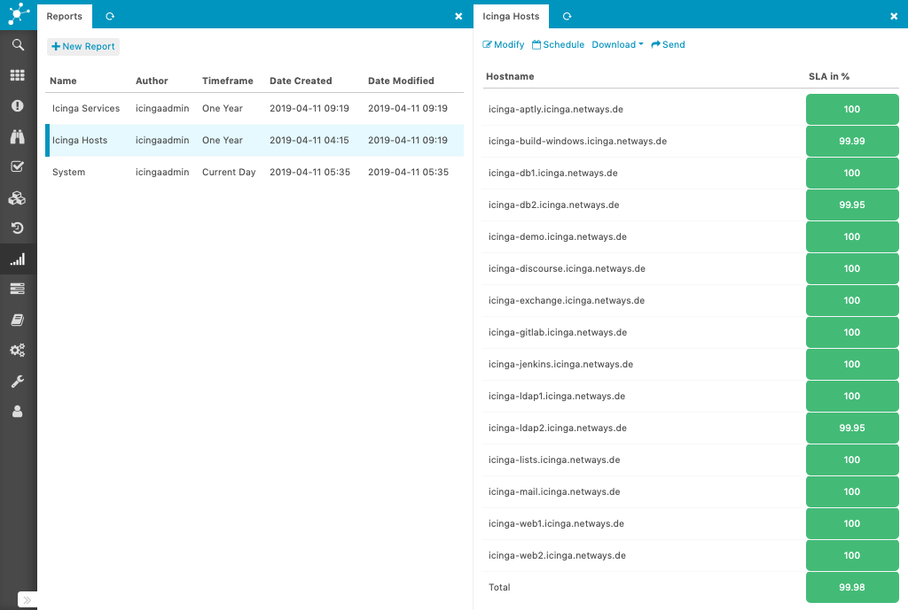

# Icinga IDO Reports

Icinga IDO Reports provides host and service availability reports for Icinga based on the monitoring
database (IDO).

## Documentation

* [Installation](doc/02-Installation.md)
